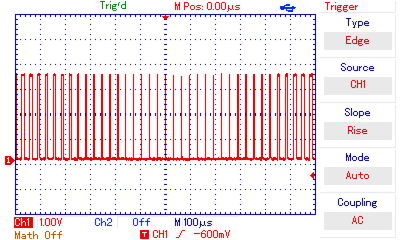
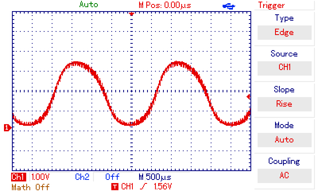

# STM8S examples using SDCC

There’s not a great number of useful examples for the stm8s chips that use sdcc.
This repository aims to fix this. The examples are currently targeting the
STM8S103F3P6 and were tested with the according dev board that is available
online for <1$.

# Resources

* [Peripherals Datasheet](http://www.st.com/content/ccc/resource/technical/document/reference_manual/9a/1b/85/07/ca/eb/4f/dd/CD00190271.pdf/files/CD00190271.pdf/jcr:content/translations/en.CD00190271.pdf)
  (has all the details on common peripherals, such as timers, UART, SPI etc)
* [STM8S103F3P6 Datasheet](http://www.st.com/content/ccc/resource/technical/document/datasheet/ce/13/13/03/a9/a4/42/8f/CD00226640.pdf/files/CD00226640.pdf/jcr:content/translations/en.CD00226640.pdf)
  (MCU-specific details)

# Run

0. You’ll need a programmer, e.g. stlink-v2 or the esp8266-based [esp-stlink](https://github.com/rumpeltux/esp-stlink)
0. Get [stm8flash](https://github.com/rumpeltux/stm8flash).

```shell
$ make
$ stm8flash -c stlinkv2 -p stm8s103f3 -w led.ihx
```

# Examples

## LED & Timer
`led.c` sets up a timer and uses the onboard LED to blink in defined intervals.

## Serial
`serial.c` demos using the UART to transmit serial data.

## Interrupts
* `serial_interrupt.c` sets up an interrupt handler to perform serial transmission
  without busy wait.
* `gpio_interrupt.c` wakes up from halt mode via external gpio interrupt on B4.

## PWM
`sound.c` uses a timer and an interrupt to create 8-bit PWM output on a pin.
You can directly attach a speaker and will hear a low-volume tone:



For better sound-quality add a 2.2μF capacitor to GND as a low-pass filter:


